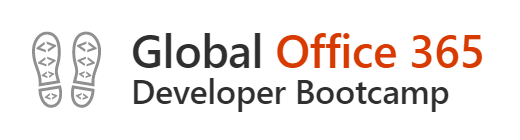

# Microsoft Teams - Bot Tutorial

I wrote this tutorial for the Office Devloper Bootcamp 2019. Hope you find it helpful :-)

The Bot Lab is build with the latest Bot Builder SDK 4. 
## Labs
### [Lab 1 - Getting Started](./docs/bot-lab-1.md)
### [Lab 2 - Adaptive Cards](./docs/bot-lab-2.md)
### [Lab 3 - Authentication](./docs/bot-lab-3.md)