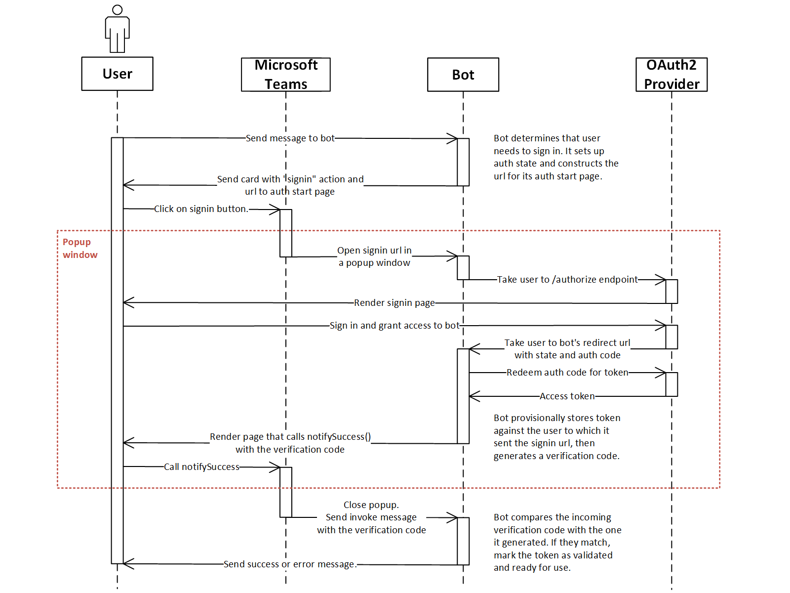
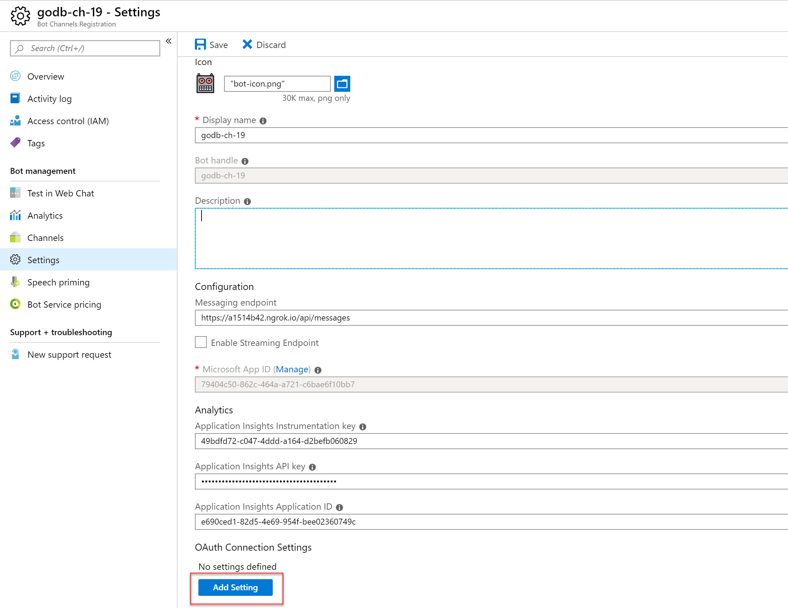
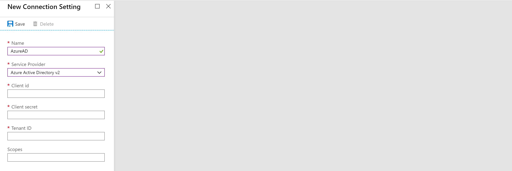
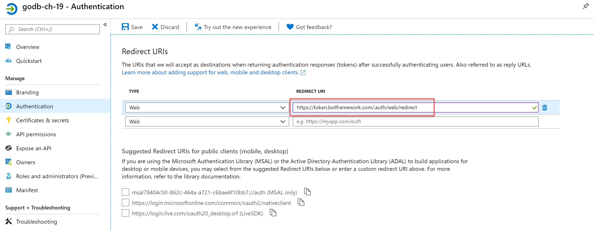
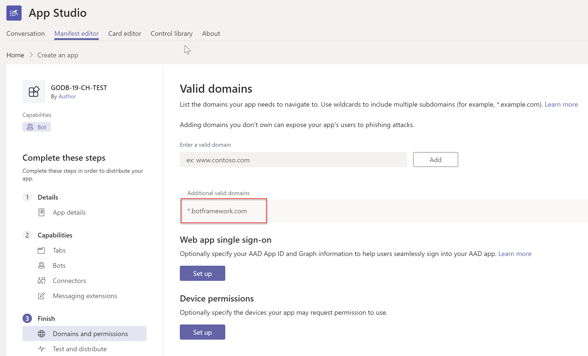
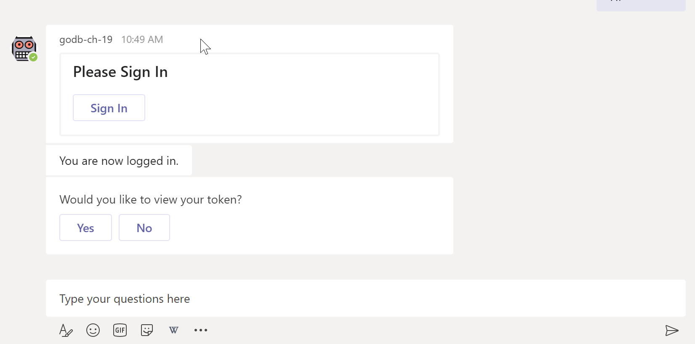

# Microsoft Teams - Bot Training
## Lab 3 - Authentication

Currently our Bot is public like a public website. In most cases we don't want this, especially for Teams Bots. In this lab we are going to setup Azure AD authenction for our Bot.

Before you start this lab setup the Bot like described in [Lab 1](./bot-lab-1.md)

### Bot Authentication Flow
This image illustrates the authentication we are going to implement.



## Configure the Bot Connector for OAuth
- Navigate to the Bot Channel Registration in Azure
- Settings -> Add Setting



- **Name:** "AzureAD"
- Choose: "**Azure Active Directory v2**"



> For demo purposes we can use her the same App Id and Password/Secret that we've used for the Bot Connector before. For production I recommend to create a separate App registration.

- **Client id**: App Id from Lab 1
- **Client secret**: App password from Lab 1
- **Tenant**: *name of you tenant e.g.mytenanat.onmicrosoft.com or use the "common" for multi tenant authentication*
- **Scopes**: "openid profile offline_access"
- Click on "Test Connection" to make sure everything is correct and grant Microsoft Graph permissions.
- Save

### Add redirect URL to app registration
Now naviagte in Azure to **Azure Active Directory** -> **App registrations**, open the App with the Id from above and add the following redirect URL in the **Authentication**: `https://token.botframework.com/.auth/web/redirect`



### Add valid domain to Teams App
You also have to configure your Teams App to trust the url ***.botframework.com**. If you forget this step and click in Teams on the Sign In button nothing will happen.

- Go to Teams **App Studio** and navigate ot to our Teams App (check out Lab 1 about Teams App Studio)
- Manifest editor -> Domains and permissions 
- Add ***.botframework.com** as a valid domain




## Implement Bot Authentication
Let's switch back to Visual Studio Code and build an OAuth Dialog:
- Add the Bot Builder Dialogs package to the project:

`dotnet add package Microsoft.Bot.Builder.Dialogs`
- Create a new folder with the name **Dialogs**
- In the just created folder create a new file called   **AuthDialog.cs**
- Copy & paste the following snippet into the file:
  

```CSharp
using System.Threading;
using System.Threading.Tasks;
using Microsoft.Bot.Builder;
using Microsoft.Bot.Builder.Dialogs;

namespace TeamsBot.Bots
{
    public class AuthBot : ActivityHandler
    {
        // Connection name of out Azure Active Directory Provider in the Bot Channel Registration
        private const string ConnectioName = "AzureAD";
        private BotState conversationState;
        private UserState userState;
        private DialogSet dialogSet;

        // The services will automatically injected via dependency injection
        public AuthBot(ConversationState conversationState, UserState userState)
        {
            this.conversationState = conversationState;
            this.userState = userState;

            // Create a DialogSet and add our AuthDialog
            // We also need to create a DialogState to persits the state of the dialogs between diffretne turns
            this.dialogSet = new DialogSet(conversationState.CreateProperty<DialogState>(nameof(DialogState)));
            this.dialogSet.Add(new AuthDialog(nameof(AuthDialog), ConnectioName));
        }

        public override async Task OnTurnAsync(ITurnContext turnContext, CancellationToken cancellationToken = default(CancellationToken))
        {
            // Create a DialogContext
            var dc = await this.dialogSet.CreateContextAsync(turnContext);

            // Check if the Bot Framework has already a cached token for the current user and if there is already an AuthDialog active
            var tokenResponse = await ((BotFrameworkAdapter)turnContext.Adapter).GetUserTokenAsync(turnContext, ConnectioName, null, cancellationToken);
            if (tokenResponse == null)
            {
                // If there is a token and the AuthDialog is still active continue the dialog
                if (dc.ActiveDialog?.Id == nameof(AuthDialog))
                {
                    await dc.ContinueDialogAsync();
                }
                else
                {
                    // If not start the AuthDialog (token null and and running AuthDialog means unsually Magic Code authentication)
                    await dc.BeginDialogAsync(nameof(AuthDialog));
                }
            }
            else
            {
                // If there is a token and the AuthDialog is still active continue the dialog
                if (dc.ActiveDialog?.Id == nameof(AuthDialog))
                {
                    await dc.ContinueDialogAsync();
                }
                else
                {
                    // When autentication is done call the base class which triggers the activity handlers like "OnMessageActivityAsync"
                    await base.OnTurnAsync(turnContext, cancellationToken);
                }
            }

            // Persist state changes at the end of every turn
            await conversationState.SaveChangesAsync(turnContext, false, cancellationToken);
            await userState.SaveChangesAsync(turnContext, false, cancellationToken);
        }
    }
}
```

- Open **Startup.cs** and ensure that the following services are added in the **ConfigureServices** method. We need them to persist the state of our auth dialog.
```CSharp
// Create the storage we'll be using for User and Conversation state. (Memory is great for testing purposes.)
services.AddSingleton<IStorage, MemoryStorage>();

// Create the User state. (Used in this bot's Dialog implementation.)
services.AddSingleton<UserState>();

// Create the Conversation state. (Used by the Dialog system itself.)
services.AddSingleton<ConversationState>();
```

- Now create a new file named **AuthBot.cs** in the **Bots** folder with the following snippet. This class will handle the authentication and  will be used as base class for out Bot.
  
```CSharp
using System.Threading;
using System.Threading.Tasks;
using Microsoft.Bot.Builder;
using Microsoft.Bot.Schema;

namespace TeamsBot.Bots
{
    public class Bot : AuthBot
    {
        // The services will automatically injected via dependency injection
        public Bot(ConversationState conversationState, UserState userState) : base(conversationState, userState)
        {
        }

        protected override async Task OnMessageActivityAsync(ITurnContext<IMessageActivity> turnContext, CancellationToken cancellationToken)
        {
            await turnContext.SendActivityAsync(MessageFactory.Text($"Echo: {turnContext.Activity.Text}"), cancellationToken);
        }
    }
}

```
The constructor automatically gets the services via dependency injection. We overwrite **OnTurnAsync** to implement our authentication. **OnTurnAsync** gets fired on any kind of event. If there isn't already a cached token for the user we start the AuthDialog.
At the end of **OnTurnAsync** we persist the state.

Now we inherit our Bot from **AuthBot**. Replace the content of **Bot.cs** (or EchoBot.cs, I renamed EchoBot to Bot in this lab) with the following snippet:

```CSharp
using System.Threading;
using System.Threading.Tasks;
using Microsoft.Bot.Builder;
using Microsoft.Bot.Schema;

namespace TeamsBot.Bots
{
    public class Bot : AuthBot
    {
        // The services will automatically injected via dependency injection
        public Bot(ConversationState conversationState, UserState userState) : base(conversationState, userState)
        {
        }

        protected override async Task OnMessageActivityAsync(ITurnContext<IMessageActivity> turnContext, CancellationToken cancellationToken)
        {
            await turnContext.SendActivityAsync(MessageFactory.Text($"Echo: {turnContext.Activity.Text}"), cancellationToken);
        }
    }
}

```

First test the authentication in the emulator. The OAuth callback only works in the emulator when you have configured ngrok in the emulator settings.

Afterwards give it a try in Teams.



Great! We have now an Azure AD token and can do awesome things with Microsoft Graph!


